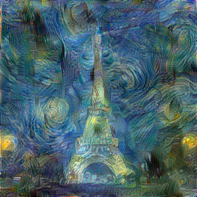
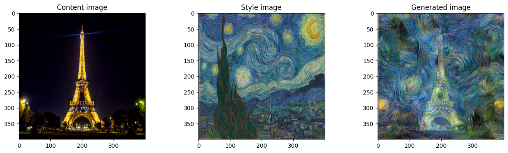
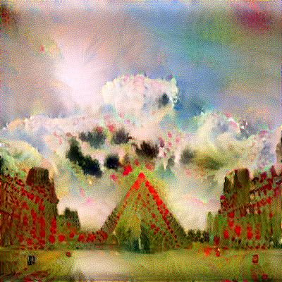

# thibaud-perrin/art-generation-NST Neural Style Transfer
This Python notebook presents a Neural Style Transfer project, an image processing technique based on neural networks. It allows you to combine the styles of a source image (style reference image) with the content of a target image to generate a new image.

## 🖼️ Preview
### Van Gogh
<div align="center">
    
    
</div>

### Monet
<div align="center">
    
    
</div>

## 📚 Requirements
- Python 3.x
- TensorFlow 2.x
- Numpy
- Matplotlib
- Pillow
- pprint
- ipywidgets
- tqdm

## 🛠️ Installation
Clone this repository to your local computer:
```bash
git clone git@github.com:thibaud-perrin/art-generation-NST.git
```
Launch your python virtual environment and install dependencies using pip:
```bash
pip install -r requirements.txt
conda activate art_gen_tf
```

## 💪 Usage
The project project is in the notebook: [deep_learning_art_neural_style_transfer.ipynb](https://github.com/thibaud-perrin/art-generation-NST/blob/main/deep_learning_art_neural_style_transfer.ipynb)  

## 👨‍🎨 Author
- [Thibaud Perrin](https://github.com/thibaud-perrin) - [LinkedIn](https://www.linkedin.com/in/thibaud-perrin/)